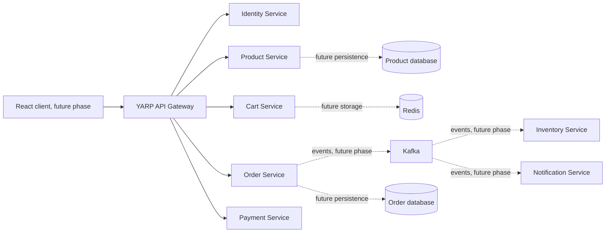

# Architecture

## System Architecture

## Phase 1 boundaries

Each service has its own ASP.NET Core host and project. Service databases and domain types will remain owned by the service that uses them; no cross-service database access or shared business model is introduced. The gateway handles routing only and does not own business behavior.

Compose currently provides shared local development dependencies: SQL Server, Redis, Kafka, and Kafka UI. It does not yet build or run the application hosts. Kafka runs as a single local KRaft broker for development, not as a production topology.